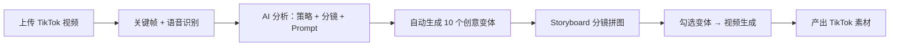

<p align="center">
  
</p>

<h1 align="center">Decipher</h1>
<p align="center"><strong>看懂爆款 → 批量复刻 → AIGC 出片</strong></p>
<p align="center">
  <a href="https://github.com/peipeijiang/decipher/releases"></a>
  <a href="https://github.com/peipeijiang/decipher/releases"></a>
</p>

---

## 痛点

做 TikTok 跨境电商的都知道：

- 刷到一个爆款视频，**说不清它为什么爆**——是 hook 狠？节奏快？字幕密？还是单纯运气好？
- 想复刻这个视频结构套自己的产品，**写不出对标的 Prompt**，翻来覆去就是 "make it cinematic"。
- 需要出 10 个视频变体测素材，**脑子里只有一个版本**。
- 请剪辑团队做分镜级视频，**沟通成本极高**，最后出片还不像。

**Decipher 解决的就是这个链路：从"看到爆款"到"产出自己的视频"，每一步都能用 AI 加速。**

---

## 看一眼界面

| 工作台 | 分析报告 |
|:---:|:---:|
|  |  |

| 创意变体 | 分镜复刻 |
|:---:|:---:|
|  |  |

---

## 核心能力：三步把爆款变成你的视频

### Step 1 — 拆解

上传一段 TikTok 爆款视频，AI 自动完成：

- **语音识别**：Whisper 转文字，拿到台词和时间轴
- **关键帧提取**：自适应场景检测，根据视频密度抽取 6-20 帧
- **多模型分析**：视觉模型看画面，文本模型看结构，综合分析输出

> 输出：**营销策略报告 + 分镜时间轴 + 逆向 Prompt**

每个分镜都带时间戳，点击跳转到对应画面位置——不再凭感觉判断"第 3 秒发生了什么"。

---

### Step 2 — 复刻

拿到原视频的核心创意公式后，AI 自动生成 **10个创意变体**：

- 每个变体包含：**标题、Hook 画面描述、开场文案、分镜序列、情绪曲线**
- 保留原视频的爆款结构，替换场景/产品/人设/情绪
- 可以直接粘贴到 Sora / 即梦 / Kling / Pika 生成视频

> 10 个变体 = 10 条素材 = 一轮投放测试，不用再为"想不出脚本"卡住。

---

### Step 3 — 出片

勾选你想要的创意变体，选择视频模型，一键提交生成：

| 模型 | 能力 | 时长 |
|------|------|------|
| **Omni Flash 10s** | 参考图 + Prompt → 视频 | 10s |
| **Seedance 2.0** | 参考图 + Prompt → 视频 | 4-15s |
| **Veo 3.1** | 图生视频 | 5-8s |
| **HappyHorse / Wan 2.6** | 文生视频 | 3-15s |

分镜复刻生成的 storyboard 自动作为参考图传入——**产品外观保真，镜头语言对版**。

---

## 为什么不是"又一个 AI 视频工具"

市面上不缺视频生成工具（Sora / 即梦 / Kling / Pika），但缺少 **"生成前的创意工作"**：

| 现有工具能做的 | Decipher 多做的 |
|---|---|
| 输入 Prompt，输出视频 | 帮你分析爆款、写出高质量 Prompt |
| 一个 Prompt 一条视频 | 一次拆解 → 10 个创意变体 → 批量生成 |
| 依赖人工判断视频结构 | AI 自动识别 hook / 卖点表达 / 转化路径 |
| 手写分镜脚本 | Storyboard 自动生成，连帧图都给你拼好 |

**Decipher 是 video AI 的"前端编辑器"**——把模糊的创意需求变成精确的可执行 Prompt。

---

## 技术架构

```
┌──────────────────────────────────────────────┐
│  前端：React 18 + Vite + TailwindCSS         │
│  后端：FastAPI + SQLAlchemy + SQLite         │
│                                               │
│  视频处理：FFmpeg + Whisper（本地 small 模型） │
│  AI 模型：DeepSeek / MiniMax / OpenAI / ...  │
│                                               │
│  部署：macOS .app 双击即用（127.0.0.1:18888）  │
└──────────────────────────────────────────────┘
```

## 快速开始

### 方式一：下载 macOS 应用（推荐）

从 [Releases](https://github.com/peipeijiang/decipher/releases) 下载 `Decipher.dmg`，双击挂载 → 拖入 `/Applications` → 双击运行。

首次运行自动安装 Python 依赖，约 1 分钟。打开浏览器访问 `http://localhost:18888`。

### 方式二：源码启动

```bash
git clone https://github.com/peipeijiang/decipher.git
cd decipher

# 后端
cd backend
cp .env.example .env   # 编辑填入 API Key
pip install -r requirements.txt
uvicorn main:app --port 8000

# 前端（新终端）
cd frontend
npm install
npm run dev -- --port 18889
```

### 配置 AI 模型

在 `.env` 或界面中的「设置 → 模型配置」里至少配置一个模型的 API Key：

```bash
DEEPSEEK_API_KEY=sk-...
MINIMAX_API_KEY=sk-...
OPENAI_API_KEY=sk-...
```

推荐 DeepSeek（性价比最高）或 MiniMax（视觉分析效果好）。

---

## 工作流程



---

## 项目组织

```
decipher/
├── frontend/src/pages/       # 页面：首页、工作台、分析页、配置等
├── backend/
│   ├── app/api/              # REST API
│   ├── app/ai_models/        # 多模型适配层
│   ├── app/services/         # 视频处理、Whisper、AI 分析
│   └── app/tasks/            # 后台分析流水线
├── docs/                     # 设计文档、迭代记录
└── dist-dmg/                 # macOS 打包脚本
```

---

## 相关项目

- [Wibly Orbit](https://github.com/peipeijiang/wibly-orbit) — 多平台社媒运营编排
- [Product UGC Pipeline](https://github.com/peipeijiang/product-ugc-pipeline) — 产品 → UGC 视频全自动流水线
