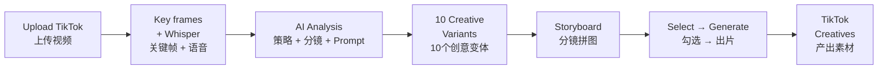

<p align="center">
  
</p>

<h1 align="center">Decipher</h1>
<p align="center">
  <strong>EN</strong> Understand viral videos → Replicate at scale → Generate with AI
</p>
<p align="center">
  <strong>CN</strong> 看懂爆款 → 批量复刻 → AIGC 出片
</p>
<p align="center">
  <a href="https://github.com/peipeijiang/decipher/releases"></a>
  <a href="https://github.com/peipeijiang/decipher/releases"></a>
  <a href="#-chinese"></a>
</p>

---

<blockquote>

**EN** &nbsp; Decipher is a TikTok video analysis workbench for cross-border e-commerce. Upload a viral video, and AI breaks it down — marketing strategy, shot-by-shot timeline, reverse-engineered prompts. Then generate 10 creative variants, auto-produce storyboard panels, and send them to your video model of choice. One click from "I saw a hit" to "I have 10 versions to test."

**CN** &nbsp; Decipher 是面向 TikTok 跨境电商的视频分析工作台。上传一段爆款视频，AI 自动拆解营销策略、分镜时间轴、逆向提示词；然后生成 10 个创意变体、自动产出 storyboard 分镜图，勾选后直接提交视频模型出片。从"看到一个爆款"到"我有 10 个版本可以投"，一步到位。

</blockquote>

---

## Pain Points · 痛点

<table>
<tr>
<td width="50%">

### EN

- You see a viral video but **can't articulate why it works** — the hook, rhythm, subtitles, or just luck?
- You want to replicate the structure for your product but **can't write a matching Prompt**.
- You need 10 variants to A/B test creatives but **only have one idea in your head**.
- Briefing an editing team at the shot level is **slow and expensive**, and the output still doesn't match.

**Decipher closes this gap: from "I saw a hit" to "I have my own video" — every step accelerated by AI.**

</td>
<td width="50%">

### CN

- 刷到一个爆款视频，**说不清它为什么爆** — hook 狠？节奏快？字幕密？还是运气？
- 想复刻这个视频结构套自己的产品，**写不出对标的 Prompt**。
- 需要出 10 个变体测素材，**脑子里只有一个版本**。
- 请剪辑团队做分镜级视频，**沟通成本极高**，出片还不像。

**Decipher 解决的正是这个链路：从"看到爆款"到"产出自己的视频"，每一步都用 AI 加速。**

</td>
</tr>
</table>

---

## Screenshots · 界面预览

<table>
<tr>
  <td align="center"><b>Workbench · 工作台</b></td>
  <td align="center"><b>Analysis Report · 分析报告</b></td>
</tr>
<tr>
  <td></td>
  <td></td>
</tr>
<tr>
  <td align="center"><b>Creative Variants · 创意变体</b></td>
  <td align="center"><b>Storyboard · 分镜复刻</b></td>
</tr>
<tr>
  <td></td>
  <td></td>
</tr>
</table>

---

## Core Capability · 核心能力

### Step 1 — Deconstruct · 拆解

<table>
<tr>
<td width="50%">

**EN** Upload a TikTok video. AI completes:

- **Speech recognition** — Whisper transcription with timestamps
- **Smart frame extraction** — adaptive scene detection, 6–20 key frames
- **Multi-model analysis** — vision model reads the visuals, text model reads the structure

> Output: **marketing strategy report + shot-by-shot timeline + reverse-engineered Prompt**

Each shot includes a timestamp. Click to jump to that moment in the video — no more guessing what happened at second 3.

</td>
<td width="50%">

**CN** 上传一段 TikTok 爆款视频，AI 自动完成：

- **语音识别** — Whisper 转文字 + 时间轴
- **智能关键帧** — 自适应场景检测，6–20 帧
- **多模型分析** — 视觉模型看画面，文本模型看结构

> 输出：**营销策略报告 + 分镜时间轴 + 逆向 Prompt**

每个分镜带时间戳，点击跳转到对应画面位置。

</td>
</tr>
</table>

---

### Step 2 — Replicate · 复刻

<table>
<tr>
<td width="50%">

**EN** After extracting the core creative formula, AI generates **10 distinct variants**:

- Each variant: **title, hook visual, opening line, shot sequence, emotional curve**
- Preserves the viral structure, swaps the scene / product / persona / emotion
- Ready to paste into Sora / Jimeng / Kling / Pika for video generation

> 10 variants = 10 creatives = one ad test cycle. No more creative block.

</td>
<td width="50%">

**CN** 拿到原视频的核心创意公式后，AI 自动生成 **10 个创意变体**：

- 每个变体：**标题、Hook 画面描述、开场文案、分镜序列、情绪曲线**
- 保留爆款结构，替换场景 / 产品 / 人设 / 情绪
- 可直接粘贴到 Sora / 即梦 / Kling / Pika 生成视频

> 10 个变体 = 10 条素材 = 一轮投放测试，不再为想不出脚本卡住。

</td>
</tr>
</table>

---

### Step 3 — Generate · 出片

<table>
<tr>
<td width="50%">

**EN** Select your preferred variants, pick a video model, and submit in one click:

| Model | Capability | Duration |
|------|------|------|
| **Omni Flash 10s** | Image + Prompt → Video | 10s |
| **Seedance 2.0** | Image + Prompt → Video | 4–15s |
| **Veo 3.1** | Image-to-Video | 5–8s |
| **HappyHorse / Wan 2.6** | Text-to-Video | 3–15s |

The storyboard grid auto-fills as the reference image — **product appearance stays faithful, shot language stays on-brand**.

</td>
<td width="50%">

**CN** 勾选创意变体，选择视频模型，一键提交：

| 模型 | 能力 | 时长 |
|------|------|------|
| **Omni Flash 10s** | 参考图 + Prompt → 视频 | 10s |
| **Seedance 2.0** | 参考图 + Prompt → 视频 | 4–15s |
| **Veo 3.1** | 图生视频 | 5–8s |
| **HappyHorse / Wan 2.6** | 文生视频 | 3–15s |

分镜 storyboard 自动作为参考图传入 — **产品外观保真，镜头语言对版**。

</td>
</tr>
</table>

---

## Why Not Just Another AI Video Tool · 差异化

<table>
<tr>
<td width="50%">

**EN** The market is full of video generation tools (Sora / Jimeng / Kling / Pika), but none handle the **creative work before generation**:

| Existing tools | Decipher adds |
|---|---|
| Prompt → Video | Analyzes the viral formula, writes a quality Prompt *for you* |
| One Prompt = one video | One deconstruction → 10 variants → batch generation |
| Manual judgment of video structure | AI identifies hooks, selling points, conversion paths |
| Hand-write shot scripts | Auto-generates storyboard panels |

**Decipher is the "front-end editor" for video AI** — turning vague creative intent into precise, executable Prompts.

</td>
<td width="50%">

**CN** 市面上不缺视频生成工具（Sora / 即梦 / Kling / Pika），但缺少 **"生成前的创意工作"**：

| 现有工具能做 | Decipher 多做的 |
|---|---|
| 输入 Prompt → 输出视频 | 帮你分析爆款、写出高质量 Prompt |
| 一个 Prompt 一条视频 | 一次拆解 → 10 个变体 → 批量生成 |
| 靠人判断视频结构 | AI 识别 hook / 卖点表达 / 转化路径 |
| 手写分镜脚本 | Storyboard 自动生成 |

**Decipher 是 video AI 的"前端编辑器"** — 把模糊的创意需求变成精确的可执行 Prompt。

</td>
</tr>
</table>

---

## Architecture · 技术架构

```
┌──────────────────────────────────────────────┐
│  Frontend: React 18 + Vite + TailwindCSS      │
│  Backend:  FastAPI + SQLAlchemy + SQLite      │
│                                               │
│  Video:    FFmpeg + Whisper (local small)     │
│  AI:       DeepSeek / MiniMax / OpenAI / ...  │
│                                               │
│  Deploy:   macOS .app, double-click to run    │
│            (http://127.0.0.1:18888)           │
└──────────────────────────────────────────────┘
```

---

## Quick Start · 快速开始

### Option 1: macOS App (Recommended) · 方式一：macOS 应用

Download `Decipher.dmg` from [Releases](https://github.com/peipeijiang/decipher/releases), mount → drag to `/Applications` → double-click.

从 [Releases](https://github.com/peipeijiang/decipher/releases) 下载 `Decipher.dmg`，双击挂载 → 拖入 `/Applications` → 双击运行。

First run auto-installs Python dependencies (~1 min). Open `http://localhost:18888`.  
首次运行自动安装 Python 依赖（约 1 分钟），打开浏览器访问 `http://localhost:18888`。

### Option 2: From Source · 方式二：源码启动

```bash
git clone https://github.com/peipeijiang/decipher.git
cd decipher

# Backend · 后端
cd backend
cp .env.example .env   # edit in your API Key · 填入 API Key
pip install -r requirements.txt
uvicorn main:app --port 8000

# Frontend · 前端 (new terminal · 新终端)
cd frontend
npm install
npm run dev -- --port 18889
```

### Configure AI Model · 配置模型

Set at least one API Key in `.env` or via the in-app Settings page.  
在 `.env` 或界面「设置 → 模型配置」里至少配一个 API Key：

```bash
DEEPSEEK_API_KEY=sk-...
MINIMAX_API_KEY=sk-...
OPENAI_API_KEY=sk-...
```

> Recommended · 推荐：DeepSeek (best value · 性价比最高) or MiniMax (best vision analysis · 视觉分析效果好).

---

## Workflow · 工作流程



---

## Project Layout · 项目结构

```
decipher/
├── frontend/src/pages/       # Pages · 页面
├── backend/
│   ├── app/api/              # REST API
│   ├── app/ai_models/        # Multi-model adapter · 多模型适配
│   ├── app/services/         # Video + Whisper + AI · 视频处理
│   └── app/tasks/            # Background pipeline · 后台流水线
├── docs/                     # Design docs · 设计文档
└── dist-dmg/                 # macOS packaging · 打包脚本
```

---

## Related Projects · 相关项目

- [Wibly Orbit](https://github.com/peipeijiang/wibly-orbit) — Multi-platform social media management · 多平台社媒运营编排
- [Product UGC Pipeline](https://github.com/peipeijiang/product-ugc-pipeline) — Product → UGC video pipeline · 产品 → UGC 视频全自动流水线
