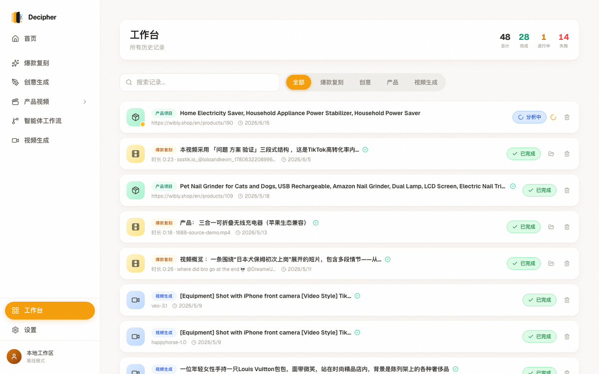
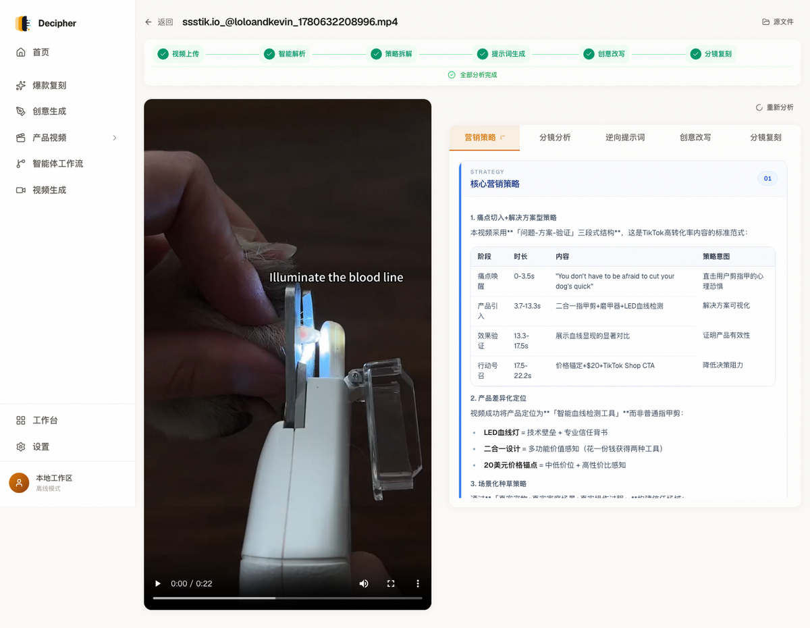
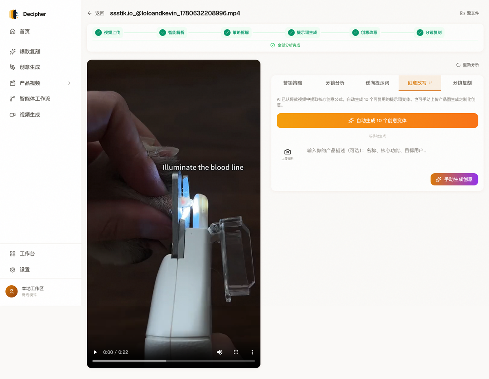
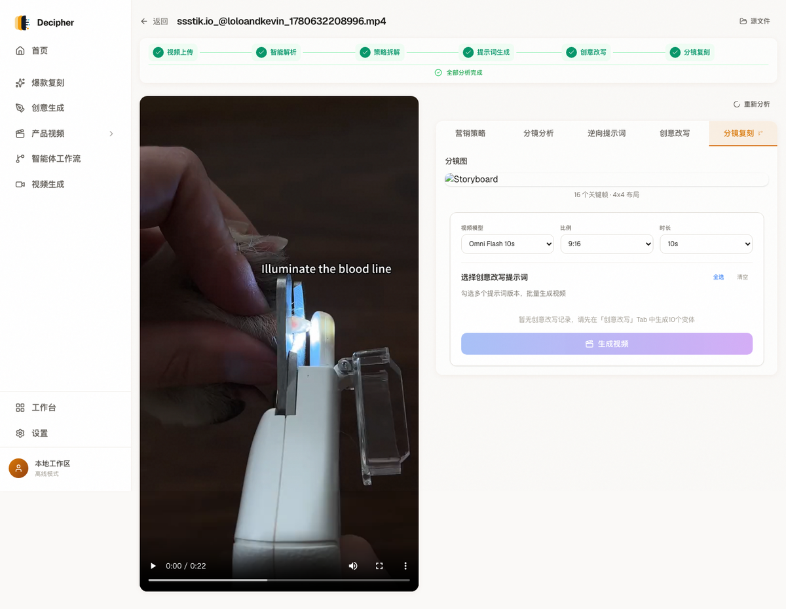
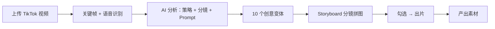

<p align="center">
  
</p>
<h1 align="center">Decipher</h1>
<p align="center">
  <strong>看懂爆款 → 批量复刻 → AIGC 出片</strong>
</p>
<p align="center">
  <a href="https://github.com/peipeijiang/decipher/releases"></a>
  <a href="https://github.com/peipeijiang/decipher/releases"></a>
  &nbsp;
  <a href="#english">English</a> · <a href="#中文">中文</a>
</p>

---

<a name="english"></a>

## English

> **Decipher** is a TikTok video analysis workbench for cross-border e-commerce. Upload a viral video — AI breaks down the marketing strategy, shot timeline, and reverse-engineered prompts. Then it generates 10 creative variants, auto-produces storyboard panels, and submits them to your video model of choice. From "I saw a hit" to "I have 10 versions to test" in one flow.

### Pain Points

- You see a viral TikTok but **can't explain why it worked** — hook, rhythm, subtitles, or just luck?
- You want to replicate the structure for your product but **can't write a matching Prompt**.
- You need 10 variants to A/B test but **only have one idea in your head**.
- Briefing an editing team at the shot level is **slow, expensive, and the output still misses the mark**.

### Screenshots

| Workbench | Analysis Report |
|:---:|:---:|
|  |  |

| Creative Variants | Storyboard |
|:---:|:---:|
|  |  |

### Core Capability: 3 Steps from Hit to Your Video

**Step 1 — Deconstruct**

Upload a TikTok video. AI handles:

- **Speech recognition** — Whisper transcription with timestamps
- **Smart frame extraction** — adaptive scene detection, 6–20 key frames
- **Multi-model analysis** — vision model reads visuals, text model reads structure

Output: **marketing strategy report + shot timeline + reverse-engineered Prompt**. Every shot has a timestamp — click to jump to that moment.

**Step 2 — Replicate**

AI extracts the core creative formula and generates **10 distinct variants**:

- Each variant: **title, hook visual, opening line, shot sequence, emotional curve**
- Preserves the viral structure, swaps scene / product / persona / emotion
- Ready to paste into Sora / Jimeng / Kling / Pika

10 variants = one ad test cycle. No more creative block.

**Step 3 — Generate**

Select variants, pick a model, submit:

| Model | Capability | Duration |
|------|------|------|
| Omni Flash 10s | Image + Prompt → Video | 10s |
| Seedance 2.0 | Image + Prompt → Video | 4–15s |
| Veo 3.1 | Image-to-Video | 5–8s |
| HappyHorse / Wan 2.6 | Text-to-Video | 3–15s |

The storyboard grid auto-fills as the reference image — product appearance stays faithful, shot language stays on-brand.

### Why Not Just Another AI Video Tool

| Existing tools | Decipher adds |
|---|---|
| Prompt → Video | Analyzes the viral formula, writes a quality Prompt *for you* |
| One prompt = one video | One deconstruction → 10 variants → batch generation |
| Manual judgment of structure | AI identifies hooks, selling points, conversion paths |
| Hand-write shot scripts | Auto-generates storyboard panels |

### Architecture

```
Frontend:  React 18 + Vite + TailwindCSS
Backend:   FastAPI + SQLAlchemy + SQLite
Video:     FFmpeg + Whisper (local small model)
AI:        DeepSeek / MiniMax / OpenAI / ...
Deploy:    macOS .app, http://127.0.0.1:18888
```

### Quick Start

**Option 1: macOS App**

Download `Decipher.dmg` from [Releases](https://github.com/peipeijiang/decipher/releases) → mount → drag to `/Applications` → double-click. First run installs deps automatically (~1 min).

**Option 2: From Source**

```bash
git clone https://github.com/peipeijiang/decipher.git
cd decipher
cd backend && cp .env.example .env && pip install -r requirements.txt
uvicorn main:app --port 8000

cd frontend && npm install && npm run dev -- --port 18889
```

**Configure AI Models**

Set at least one API Key in `.env` or the in-app Settings page. Recommended: DeepSeek (best value) or MiniMax (best vision).

### Workflow


### Related Projects

- [Wibly Orbit](https://github.com/peipeijiang/wibly-orbit) — Multi-platform social media management
- [Product UGC Pipeline](https://github.com/peipeijiang/product-ugc-pipeline) — Product → UGC video pipeline

---

<a name="中文"></a>

## 中文

> **Decipher** 是面向 TikTok 跨境电商的视频分析工作台。上传一段爆款视频，AI 自动拆解营销策略、分镜时间轴、逆向提示词；然后生成 10 个创意变体、自动产出 storyboard 分镜图，勾选后直接提交视频模型出片。从"看到一个爆款"到"我有 10 个版本可以投"，一步到位。

### 痛点

- 刷到一个爆款视频，**说不清它为什么爆** — hook 狠？节奏快？字幕密？还是运气？
- 想复刻这个视频结构套自己的产品，**写不出对标的 Prompt**。
- 需要出 10 个变体测素材，**脑子里只有一个版本**。
- 请剪辑团队做分镜级视频，**沟通成本极高**，最后出片还不像。

### 界面预览

| 工作台 | 分析报告 |
|:---:|:---:|
|  |  |

| 创意变体 | 分镜复刻 |
|:---:|:---:|
|  |  |

### 核心能力：三步把爆款变成你的视频

**Step 1 — 拆解**

上传一段 TikTok 爆款视频，AI 自动完成：

- **语音识别** — Whisper 转文字 + 时间轴
- **智能关键帧** — 自适应场景检测，6–20 帧
- **多模型分析** — 视觉模型看画面，文本模型看结构

输出：**营销策略报告 + 分镜时间轴 + 逆向 Prompt**。每个分镜带时间戳，点击跳转到对应画面位置。

**Step 2 — 复刻**

拿到原视频的核心创意公式后，AI 自动生成 **10 个创意变体**：

- 每个变体：**标题、Hook 画面描述、开场文案、分镜序列、情绪曲线**
- 保留爆款结构，替换场景 / 产品 / 人设 / 情绪
- 可直接粘贴到 Sora / 即梦 / Kling / Pika 生成视频

10 个变体 = 10 条素材 = 一轮投放测试，不再为想不出脚本卡住。

**Step 3 — 出片**

勾选创意变体，选择视频模型，一键提交：

| 模型 | 能力 | 时长 |
|------|------|------|
| Omni Flash 10s | 参考图 + Prompt → 视频 | 10s |
| Seedance 2.0 | 参考图 + Prompt → 视频 | 4–15s |
| Veo 3.1 | 图生视频 | 5–8s |
| HappyHorse / Wan 2.6 | 文生视频 | 3–15s |

分镜 storyboard 自动作为参考图传入 — **产品外观保真，镜头语言对版**。

### 为什么不是"又一个 AI 视频工具"

| 现有工具能做 | Decipher 多做的 |
|---|---|
| 输入 Prompt → 输出视频 | 帮你分析爆款、写出高质量 Prompt |
| 一个 Prompt 一条视频 | 一次拆解 → 10 个变体 → 批量生成 |
| 靠人判断视频结构 | AI 识别 hook / 卖点表达 / 转化路径 |
| 手写分镜脚本 | Storyboard 自动生成 |

### 技术架构

```
前端：React 18 + Vite + TailwindCSS
后端：FastAPI + SQLAlchemy + SQLite
视频：FFmpeg + Whisper（本地 small 模型）
AI：  DeepSeek / MiniMax / OpenAI / ...
部署：macOS .app，http://127.0.0.1:18888
```

### 快速开始

**方式一：macOS 应用（推荐）**

从 [Releases](https://github.com/peipeijiang/decipher/releases) 下载 `Decipher.dmg` → 拖入 `/Applications` → 双击运行。首次自动安装依赖，约 1 分钟。

**方式二：源码启动**

```bash
git clone https://github.com/peipeijiang/decipher.git
cd decipher
cd backend && cp .env.example .env && pip install -r requirements.txt
uvicorn main:app --port 8000

cd frontend && npm install && npm run dev -- --port 18889
```

**配置 AI 模型**

在 `.env` 或界面「设置 → 模型配置」至少配一个 API Key。推荐 DeepSeek（性价比最高）或 MiniMax（视觉分析效果好）。

### 工作流程



### 相关项目

- [Wibly Orbit](https://github.com/peipeijiang/wibly-orbit) — 多平台社媒运营编排
- [Product UGC Pipeline](https://github.com/peipeijiang/product-ugc-pipeline) — 产品 → UGC 视频全自动流水线
